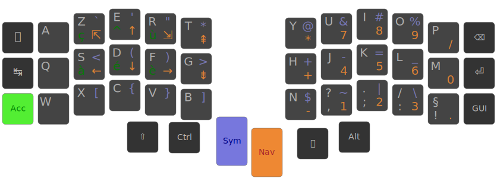

# c7z keymap for Corne split keyboard

Personal keymap, named c7z (pronounce "citizen").  
Designed for French coder to ease learning on a [Corne keyboard](https://github.com/foostan/crkbd).

The first layer is an AZERTY keymap.  
The other layers are based on [Ergo-L keymap](https://github.com/Nuclear-Squid/ErgoL).

Files provided are for [QMK firmware](https://docs.qmk.fm/), with [RP2040](https://docs.qmk.fm/platformdev_rp2040).

Install QMK : https://docs.qmk.fm/cli#qmk-cli  
Set default keymap : `qmk config user.keymap=c7z`  
Reset current firmware : Double click on reset button and wait few seconds
Compile & copy firmware : `qmk compile && cp crkbd_rev1_c7z.uf2 /media/jacques/RPI-RP2/`
